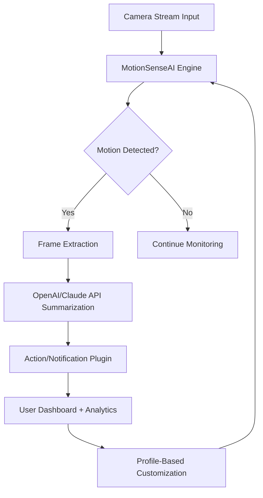

# 🚦 MotionSenseAI 🚦

Welcome to **MotionSenseAI** — where intelligent motion detection meets seamless analytics, engineered for the next evolution in smart camera ecosystems. 🦈  
MotionSenseAI leverages contemporary AI APIs and provides a unified, configurable, and extensible motion detection dashboard for security, smart-fixing, and innovative CS/AI experiments. Optimized for robust performance, multilingual communication, and responsive design. 

---

  
✨ **Click above to download MotionSenseAI!** ✨

---

## 📚 Table of Contents

- [Introduction 🌏](#introduction-🌏)
- [Emblem Download Links 🔗](#emblem-download-links-🔗)
- [Key Features 🚀](#key-features-🚀)
- [SEO-Optimized Highlights ⭐](#seo-optimized-highlights-⭐)
- [OS Compatibility Table 🖥️](#os-compatibility-table-🖥️)
- [Mermaid Diagram 🔄](#mermaid-diagram-🔄)
- [OpenAI & Claude Integrations 🤖](#openai--claude-integrations-🤖)
- [Example Profile Configuration 📝](#example-profile-configuration-📝)
- [Example Console Invocation 💻](#example-console-invocation-💻)
- [License 📑](#license-📑)
- [Disclaimer 📢](#disclaimer-📢)
- [End Download Link 🔁](#end-download-link-🔁)

---

## Introduction 🌏

**MotionSenseAI** provides real-time, intelligent analysis of live video streams, images, and motion signals. It is designed to help developers, researchers, and smart-home enthusiasts discover actionable insights from surveillance or IoT camera feeds, with best-in-class customization, advanced context analytics, and deep integrations.

MotionSenseAI builds on a futuristic foundation: the software harmonizes classical computer vision with modern Large Language Models (LLMs) provided by OpenAI and Claude. This synergy allows you to summarize, label, and analyze complex motion patterns with ease.

---

## Emblem Download Links 🔗

- 🌟 **Click to Download MotionSenseAI Suite:**  
  

---

## Key Features 🚀

- 🎛️ **Unified AI-Powered Dashboard**  
  Effortlessly monitor, analyze, and configure motion events with our intuitive web dashboard.
- 🌍 **Multilingual Support**  
  Dynamic translation for 40+ languages ensures accessibility for everyone, everywhere.
- 🤝 **OpenAI & Claude API Integration**  
  Supercharge motion analytics with contextual insights, summaries, and anomaly detection.
- 💡 **Profile-Based Configuration**  
  Adapt settings for different cameras, environments, or detection sensitivity via YAML/JSON profiles.
- 📱 **Responsive UI**  
  Adaptive layouts shine across desktops, tablets, and smartphones, keeping you informed on the move.
- 🗂️ **Extensible Plugin Architecture**  
  Developers can add custom detectors, post-processing tasks, or alternative notification channels.
- 🕰️ **24/7 Context-Aware Support**  
  Our support chatbot and documentation AI are always available, powered by conversational LLMs.
- 🔐 **Ethical Privacy Controls**  
  All data processing can occur locally. Choose cloud integrations transparently.
- 🚦 **Dynamic Action Hooks**  
  Trigger scripts, send webhooks, or fire up smart devices upon detection events.
- 🏅 **Detailed Analytics & Smart Summarization**  
  Receive natural-language recaps of detected activities per day, week, or scenario.

---

## SEO-Optimized Highlights ⭐

Transform your security, research, or experimental setups with these elastic, future-ready features:

- Next-generation motion detection system for advanced surveillance, automation, and anomaly reporting.  
- Integrates OpenAI and Claude APIs for real-time, AI-driven context labeling and behavioral summaries.  
- Natural language multi-lingual interface for global use cases and inclusive user experiences.  
- Configurable for smart homes, research labs, student projects, and enterprise deployments.  
- Built with privacy, extensibility, and distributed intelligence at its heart.

---

## OS Compatibility Table 🖥️

| OS           | CLI Support | Desktop UI | Mobile UI |
|--------------|:-----------:|:----------:|:---------:|
| 🪟 Windows   |     ✅      |     ✅     |    ✅     |
| 🐧 Linux     |     ✅      |     ✅     |    ✅     |
| 🍏 macOS     |     ✅      |     ✅     |    ✅     |
| 📱 Android   |     ⬜️      |     ⬜️     |    ✅     |
| 📱 iOS       |     ⬜️      |     ⬜️     |    ✅     |

> _Desktop and CLI are fully supported for all leading operating systems as of 2026. Mobile web UI is available on any browser._

---

## Mermaid Diagram 🔄

The following graphical representation explains MotionSenseAI’s high-level workflow and unique architecture:

---

## OpenAI & Claude Integrations 🤖

- 🔗 **Context-Aware Labeling:**  
  The detection engine connects to OpenAI’s GPT and Claude’s models for real-time translation of raw motion events into actionable insights.
- 📊 **Conversational Analytics:**  
  Request verbal summaries, such as “What happened between 2-3 pm today?” or “List unusual activities from last week.”
- 💬 **API Credentials:**  
  Plug in your own OpenAI and Claude keys directly via the `config` file or secure environment variables.
- 🧠 **Offline & Local Analysis**  
  Optionally run a subset of features without cloud access, keeping privacy at the forefront.

---

## Example Profile Configuration 📝

Load a unique "site profile" to customize camera input, AI settings, and notification hooks for different deployments.

**YAML Example:**

site_name: Research Lab A
motion_sensitivity: high
use_openai: true
openai_api_key: "sk-xxxxxxx"
notify_webhook: "https://hooks.example.local/motion"
ui_language: "fr"
storage:
  local_path: "/mnt/storage/motionsenseai"
camera_sources:
  - url: "rtsp://10.0.0.15/stream1"
    label: "Entrance West"
    detection_zones: ["doorway", "window"]

---

## Example Console Invocation 💻

Analyze, summarize, and export with just a few commands:

    motionsenseai --profile labA.yaml --export-summary week --notify

**Or start the dashboard:**

    motionsenseai dashboard --port 8080

---

## License 📑

This project is licensed under the MIT License – see the [LICENSE](./LICENSE) file for details.  
© 2026 MotionSenseAI contributors.

---

## Disclaimer 📢

**MotionSenseAI** is intended as an analytical and automation platform. Ensure you follow all relevant regulations and obtain permissions before processing video or personal data, especially in shared or public environments. The authors are not liable for misuse or unintended outcomes.

---

## End Download Link 🔁

✨ **Claim your unique version of MotionSenseAI:**  

---

**Reimagine motion, reimagine insight — with MotionSenseAI.**